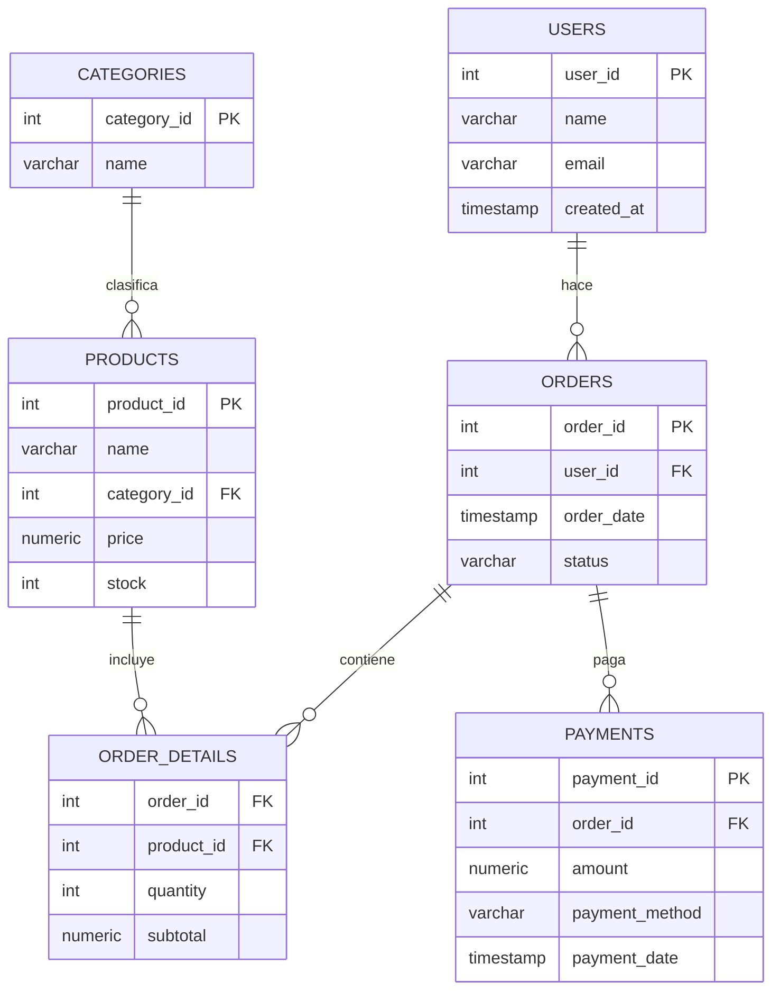

# 🛒 Ecommerce Database Project


Este proyecto contiene una base de datos de un **E-commerce** creada en **PostgreSQL 15**, desplegada con **Docker**, y acompañada de un conjunto de **consultas analíticas** para demostrar habilidades en SQL.

---

## 🚀 Cómo usar el proyecto

### 1️⃣ Levantar los servicios
Ejecuta en tu terminal:

```bash
docker-compose up -d
```

Esto levantará un contenedor PostgreSQL con una base vacía llamada `ecommerce_db`.

### 2️⃣ Importar la base de datos
Restaura el backup incluido en la carpeta `data/`:

```bash
docker exec -i my-database psql -U Christian_Cazorla -d ecommerce_db < data/ecommerce_db.sql
```

### 3️⃣ Conectarse a la base
Puedes conectarte usando **TablePlus**, **DBeaver** o cualquier cliente SQL con estas credenciales:

- **Host**: `localhost`  
- **Port**: `5432`  
- **User**: `Christian_Cazorla`  
- **Password**: `123456`  
- **Database**: `ecommerce_db`  

---

## 🗂️ Esquema de la base de datos

La base de datos contiene tablas relacionadas con usuarios, productos, pedidos y pagos.  

### 📌 Tablas principales

- **users** 👤 → Información de clientes (nombre, email, fecha de creación).  
- **products** 📦 → Catálogo de productos (nombre, categoría, precio, stock).  
- **categories** 🏷️ → Clasificación de productos (Ej: Electrónica, Ropa).  
- **orders** 🧾 → Pedidos realizados por los usuarios.  
- **order_details** 🛍️ → Detalle de cada pedido (producto, cantidad, subtotal).  
- **payments** 💳 → Pagos asociados a pedidos (método de pago, fecha, monto).  

---

## 📊 Consultas analíticas incluidas

El archivo [`queries/analysis_queries.sql`](../queries/analysis_queries.sql) contiene **20 consultas** que permiten analizar los datos.  

Ejemplos:

- 🔝 **Top 10 productos más vendidos**  
- 👥 **Clientes con mayor gasto total**  
- 📈 **Evolución de ingresos por mes**  
- 🛒 **Carrito promedio por cliente**  
- 📦 **Productos sin ventas registradas**  

---

## 📂 Estructura del proyecto

```
ecommerce-project/
│── data/
│   └── ecommerce_db.sql        # Backup limpio de la base de datos
│
│── queries/
│   └── analysis_queries.sql    # 20 consultas analíticas en SQL
│
│── docs/
│   └── README.md               # Documentación del proyecto
│
│── docker-compose.yml          # Configuración de PostgreSQL con Docker
│── .gitignore                  # Archivos y carpetas ignoradas por Git
```

---

## 📐 Diagrama entidad-relación



---

## ✨ Autor

👨‍💻 **Christian Cazorla**  
📧 [alumno@google.com](mailto:alumno@google.com)  
🔗 [LinkedIn](https://www.linkedin.com/) | [GitHub](https://github.com/)  

---
